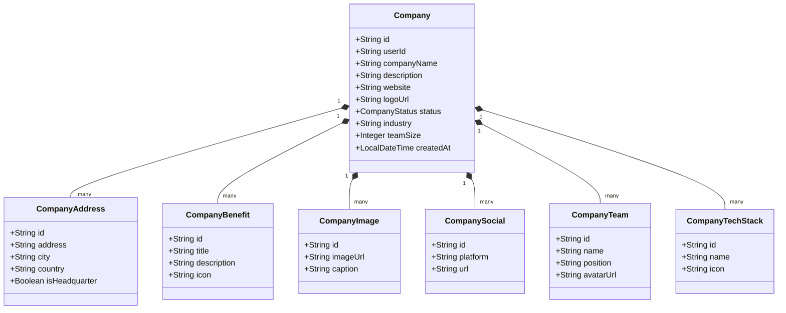

# 🏢 Company Service (Quản lý Hồ sơ Doanh nghiệp & Nhà tuyển dụng)

`CompanyService` chịu trách nhiệm quản lý toàn bộ thông tin về hồ sơ doanh nghiệp, cơ cấu tổ chức, địa điểm văn phòng, phúc lợi nhân viên, bộ sưu tập hình ảnh và quy trình phê duyệt công ty tuyển dụng. Service được xây dựng theo kiến trúc **CQRS** bằng **Axon Framework**, lưu trữ tài nguyên đa phương tiện qua **Cloudinary** và tích hợp sự kiện qua **Apache Kafka**.

---

## 📌 Thông tin tổng quan

- **Tên ứng dụng**: `company-service`
- **Port mặc định**: `8083`
- **Cơ sở dữ liệu**: MySQL (`companydb`) trên port `3308`
- **Swagger Documentation**: `http://localhost:8083/swagger-ui.html`
- **Tích hợp Cloud**: Cloudinary CDN (Upload Logo & Media gallery)
- **Axon Server**: `localhost:8124`
- **Kafka Topic xuất bản**: `company-events`

---

## 🏗 Kiến trúc & Mô hình Dữ liệu



---

## 📋 Danh sách API Endpoints

### 1. Quản lý Hồ sơ Doanh nghiệp (`/api/v1/companies`)

| Method | Endpoint | Mô tả | Quyền / Ghi chú |
| :--- | :--- | :--- | :--- |
| `POST` | `/api/v1/companies` | Tạo mới hồ sơ công ty dành cho Nhà tuyển dụng | Recruiter |
| `PUT` | `/api/v1/companies/{companyId}` | Cập nhật thông tin công ty | Recruiter / Owner |
| `DELETE` | `/api/v1/companies/{companyId}` | Xóa hồ sơ công ty | Admin / Owner |
| `GET` | `/api/v1/companies` | Danh sách công ty công khai (Tìm kiếm theo tên, ngành nghề, địa điểm, phân trang) | Public |
| `GET` | `/api/v1/companies/{companyId}` | Chi tiết công ty kèm đầy đủ văn phòng, quyền lợi, ảnh, tech stack | Public |
| `GET` | `/api/v1/companies/my-company` | Lấy thông tin công ty của NTD đang đăng nhập | Authenticated |
| `GET` | `/api/v1/companies/admin` | Danh sách công ty dành cho Quản trị viên (lọc theo trạng thái chờ duyệt) | Admin |
| `PUT` | `/api/v1/companies/{companyId}/approve` | Phê duyệt công ty hoạt động | Admin |
| `PUT` | `/api/v1/companies/{companyId}/reject` | Từ chối yêu cầu đăng ký công ty | Admin |
| `PUT` | `/api/v1/companies/{companyId}/status` | Cập nhật trạng thái (`PENDING`, `ACTIVE`, `REJECTED`, `INACTIVE`) | Admin |
| `POST` | `/api/v1/companies/{companyId}/logo` | Tải lên Logo công ty (Cloudinary) | Form-data (`file`) |
| `DELETE` | `/api/v1/companies/{companyId}/logo` | Xóa Logo công ty | Owner |
| `PUT` | `/api/v1/companies/{companyId}/settings/overview` | Cập nhật trang tổng quan và thông tin liên hệ | Owner |

### 2. Các phân hệ trực thuộc Doanh nghiệp

- **Địa điểm & Trụ sở (`/api/v1/companies/{companyId}/addresses`)**:
  - `GET / POST`: Lấy danh sách & Thêm địa chỉ chi nhánh/trụ sở chính.
  - `PUT / DELETE /{addressId}`: Cập nhật & Xóa địa chỉ.
- **Phúc lợi & Quyền lợi (`/api/v1/companies/{companyId}/benefits`)**:
  - `GET / POST`: Quản lý các chế độ đãi ngộ (bảo hiểm, thưởng, đào tạo, thiết bị...).
  - `PUT / DELETE /{benefitId}`: Sửa & Xóa phúc lợi.
- **Thư viện Hình ảnh (`/api/v1/companies/{companyId}/images`)**:
  - `POST`: Upload nhiều ảnh môi trường làm việc lên Cloudinary.
  - `GET / DELETE /{imageId}`: Xem danh sách ảnh & Xóa ảnh.
- **Mạng Xã hội (`/api/v1/companies/{companyId}/socials`)**:
  - `GET / POST / PUT / DELETE`: Quản lý các liên kết mạng xã hội (LinkedIn, Facebook, Twitter, GitHub...).
- **Đội ngũ & Lãnh đạo (`/api/v1/companies/{companyId}/teams` & `members`)**:
  - `GET / POST / PUT / DELETE`: Thông tin ban lãnh đạo và các thành viên đại diện.
- **Tech Stacks (`/api/v1/companies/{companyId}/tech-stacks`)**:
  - `POST / PUT / DELETE`: Cập nhật công nghệ/ngôn ngữ công ty sử dụng.

---

## 📡 Kafka Events (Producer)

Service gửi thông điệp vào topic `company-events`:

| Event Type | Khi nào kích hoạt | Mô tả |
| :--- | :--- | :--- |
| `CompanyApprovedEvent` | Admin phê duyệt công ty | Gửi email thông báo chúc mừng cho Nhà tuyển dụng |
| `CompanyRejectedEvent` | Admin từ chối công ty | Gửi email thông báo lý do từ chối cho Nhà tuyển dụng |
| `CompanyStatusUpdatedEvent`| Thay đổi trạng thái công ty | Thông báo trạng thái cập nhật |

---

## ⚙ Cấu hình chính (`application.yaml`)

```yaml
server:
  port: 8083

spring:
  application:
    name: company-service
  datasource:
    url: jdbc:mysql://localhost:3308/companydb?useSSL=false&serverTimezone=Asia/Ho_Chi_Minh
    username: root
    password: <YOUR_PASSWORD>
  security:
    oauth2:
      resourceserver:
        jwt:
          issuer-uri: http://localhost:8080/realms/jobhuntly

cloudinary:
  cloud-name: <CLOUDINARY_NAME>
  api-key: <CLOUDINARY_KEY>
  api-secret: <CLOUDINARY_SECRET>
```

---

## 🏃 Hướng dẫn chạy Service

```bash
cd CompanyService
mvn spring-boot:run
```
